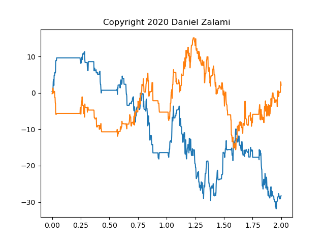

# Monte Carlo Simulation of uncoupled Continuous-time random walks 

This is a python implementation of the algorithm purposed in a Paper of <i>D. Fulger et. al </i> in 2008.

Fulger, D., Scalas, E., & Germano, G. (2008). Monte Carlo simulation of uncoupled continuous-time random walks yielding a stochastic solution of the space-time fractional diffusion equation. Physical Review E - Statistical, Nonlinear, 
and Soft Matter Physics, 77(2), 1–7. <a href="https://doi.org/10.1103/PhysRevE.77.021122">https://doi.org/10.1103/PhysRevE.77.021122</a>

## Install
some text

## Example
Run example_ctrw.py without any arguments to create a two dimensional CTRW and plot it versus time with matplotlib
